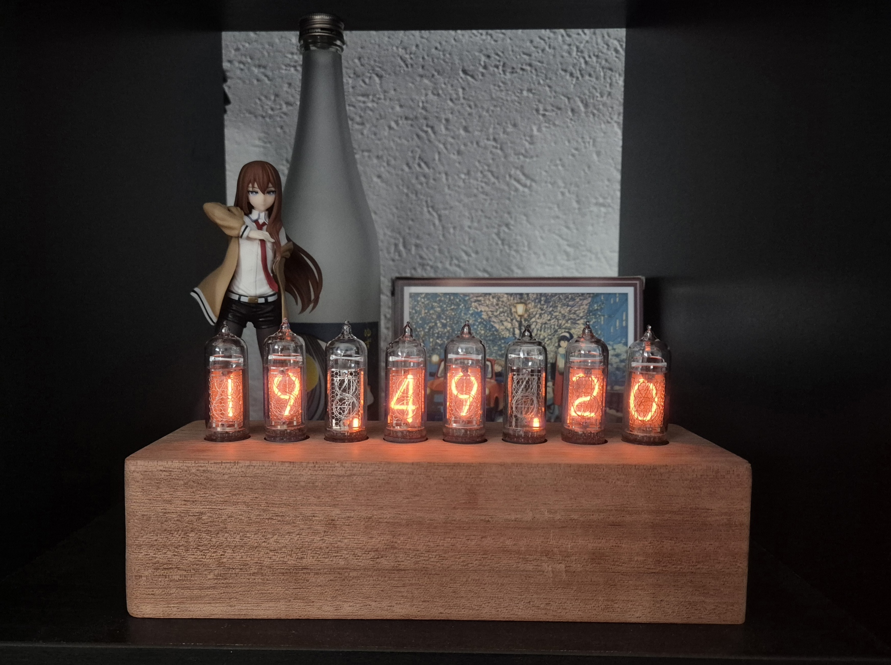

# Nixie clock - Divergence Meter

I wanted to make a 8-tube design to match Steins Gate's divergence meter and to have more display capabilities.

## How to use

- On power on, if a wifi access point has been provided before, it will try to connect to it.
- Otherwise (if no AP, or if connection fails) it will display blinking dots and it will turn into an access point named "ESP32_Nixie".
  Connect to it, open the clock's IP on a web page, and provide wifi SSID and password. The clock will then
  try to connect to the provided wifi AP.
- It will start displaying the time. You can press the toggle swith (long or short press) to change modes.

## How to build

There should be most of the design files for software and hardware to reproduce it.

Except:
- Tubes that I bought on Ebay
- The BOM is not exaclty complete but all the electronics to build the PCB are there. What's missing is
    - the Molex ribbon cables (check the reference of the connectors and find the matching ones)
    - few pin headers and jumpers
- The case that is home made with some very specific tools.

---

## Hardware

See hardware/*.pdf for the design sheet and layer views. All Kicad design files should be present to build them and the gerber files.

key facts:

- Made for 8 IN-14 tubes
- HV DCDC generator made on board, based on [this design](https://nick.desmith.net/Electronics/NixiePSU.html)
- HV open drain shift registers HV5622 (no multiplexing)
- ESP32C3 module
- Most of the components are solderable with a soldering iron (except the ESP32 because of the pads underneath, heat gun or hot plate required + stencil)

#### Version 1.1 updates:

Fixed HV5622 footprint, used a bigger DCDC FET (Vds rated >250V), Reduced GPIO9 cap size to avoid starting in DL mode, and added PD resistors to the level shifters' NFETs.

### Issues

The feedback line of the DCDC is picking up noise which creates a visible dimming oscillation at around 20Hz (50Vpp). At high load it even makes the DCDC saturate.
I fixed it by adding a small cap (100pF) on FB pin. 0603 size is perfect to sit between SHDN and FB pins of the MAX1771.

My DCDC has only a ~70% efficiency which is not super good compared to the original design (85%), I probably did a poor layout job. But in practice it does not matter since currents involved are small.

## Software

key facts:

- Using ESP-IDF VSCode extension v5.2.1
- Programming via UART (two buttons on the board to get the ESP in download mode)
- Has a "maintenance" routine timer to cycle the cathodes lit to prevent cathode poisonning.

More modes to be coming (with a connected weather station it will be able to display temp/HR...).

- main/src/Connectivity.c - wifi state machine, mDNS & SNTP setup.
- main/src/HV5622.c - Bit banging shift register driver.
- main/src/ModeSwitch.c - Driver for the toggle switch.
- main/src/NixieDisplay.c - simple driver to display data on the 8 tubes using the shift registers.
- main/src/NixieHttpServer.c - Web control page
- main/src/SmartClock.c - core logic of the clock to display time, handle different modes.
- main/src/Storage.c - NVS wrapper for storing wifi credentials.

